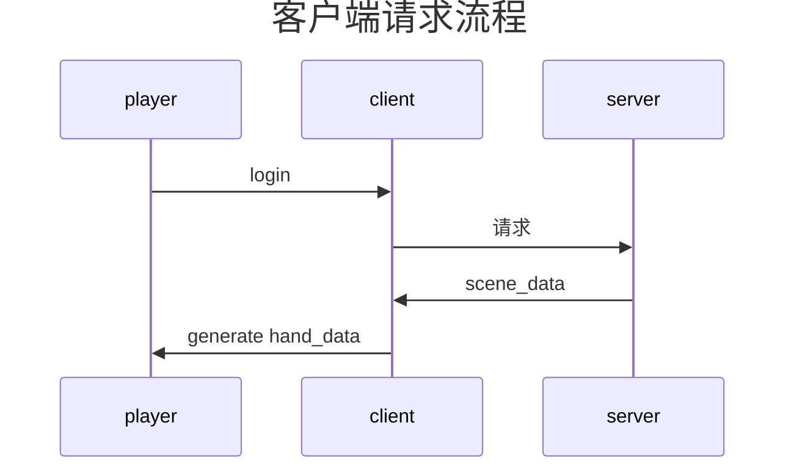

# server

```
cd server
pip install -r requirements.txt
python main.py
```

# client

```
npm install
npm run dev
```

if you want to run in the network, you should also set .env file like this:

```
VITE_SERVER_API_BASE_URL=http://192.168.31.78:8000
```

# design

1. 游戏机制尽量通过卡牌实现  
    比如挑选职业，也是选一张卡，只不过限制了之后卡池  
    比如遗物，也是获得一张卡，只不过这张并不需要打出，而是自动生效  
    这样的好处就是设计游戏，简化成了设计卡牌，至于数值，可以用过选择率来调整

2. 卡牌尽量不设种类，而是标签组合  
    比如除了职业卡，还有环境卡，环境卡出现的条件是地图，  
    假设地图是工厂，可以设计一张卡车，2费抽5张  
    还可以设计阶段卡，有一些卡出现在特定阶段

3. 避免出现无限流卡组，但是尽量丰富combo  
    比如无限抽牌，无限叠甲  
    combo比如活动肌肉回旋镖，重振硬撑，    
    玩家的回合伤大概以百分之7的速率增长  
    也因此初始卡组多了一张打击一张防御，  
    但是也增加了从卡池自选卡的机制
    
4. 通过统计玩家抽取率，来调整卡牌数值  
    比如玩家抽取率高的卡，就减少数值，抽取率低的卡，就增加数值  
    这个我是受杀戮尖塔一个统计选取率的插件的启发  
    平衡性就是一点一点加，重新统计抽取率  

5. 调整杀戮尖塔中aoe卡，改成单目标但提升数值

5. 灵感的来源  
    主要来源于杀戮尖塔  
    以及炉石传说，也包括魔兽世界，dnd5e  

6. 参与卡牌设计, 参照card_*.yaml文件格式
    
7. 卡牌设计，卡牌氛围两种，一种是事件卡，用于记录事件并生效，一种是重复使用卡，用于构建卡组
    1. event
        1. tag：
            1. 职业卡
            2. 遗物卡
            3. 事件卡
        2. 生效时机 trigger
            1. 选择时
            2. 战斗开始
            3. 战斗结束
            4. 回合开始时
            5. 回合结束时
            6. 抽牌时
            7. 弃牌时
            8. 死亡时
    2. useable deck 卡组
        1. 区域
            1. draw 抽牌
            2. hand 手牌
            3. power 能力牌区
            4. discard 弃牌
            5. consume 消耗

8. 每个操作都是一个动画  
   每个东西都是一个图片  
   每个数据交互都是一个请求
---


---
